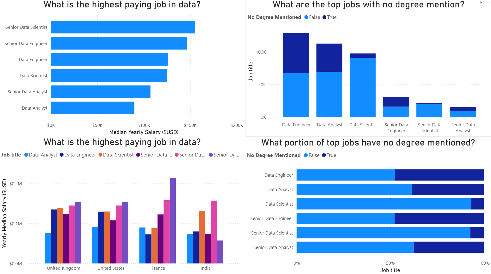

📊 Data Job Market Analysis Dashboard (2024)
An interactive Power BI dashboard designed to explore the global landscape of data-related careers. This project transforms raw job posting data into actionable insights regarding compensation, requirements, and hiring trends.
 (2.png) 
(3.png) (4.png) (5.png) (6.png) (7.png) (8.png) (9.png) (10.png)
🌟 Executive Summary
The dashboard analyzes over 479,000 job postings to provide a 360-degree view of the data industry. It highlights the shift toward remote work, the premium on senior roles, and the evolving educational requirements in the tech sector.

🔍 Key Dashboard Modules
💰 Compensation & Salary Insights
High-Earners: Identification of top-paying roles, led by Senior Data Scientists and ML Engineers (Median > $150K).

Pay Correlation: Analysis of Yearly vs. Hourly wages to identify the most lucrative employment types (Full-time vs. Contract).

Quarterly Shifts: A Sankey flow visualization showing how median salaries fluctuated across Q1-Q4 2024.

📈 Market Dynamics & Trends
Job Volatility: A time-series analysis showing job posting peaks and troughs throughout the year.

Global Footprint: Geographic Heatmaps displaying job density in North America, Europe, and Asia.

Recruitment Funnel: A detailed funnel showing the conversion rate from Job Views (5K) to Hires (0.1K), revealing a competitive ~2% hiring rate.

🎓 Barriers to Entry & Perks
The "No Degree" Factor: Visualizing the 33% of jobs that prioritize skills over formal degrees.

Work-Life Balance: Tracking the 13% WFH (Work From Home) adoption rate across different data roles.

Benefit Analysis: Breakdown of total compensation including Base Salary, Stock Options, and Bonuses.

🛠 Tech Stack & Methodology
Data Modeling: Power BI (DAX) used to calculate complex metrics like "Salary Star Rating."

Visualizations: Custom Sankey diagrams, Funnel charts, Gauge visuals, and Geographic maps.

Interactivity: Integrated Drill-Through pages allowing users to click a job title (e.g., Senior Data Scientist) and see a dedicated deep-dive report.

💡 Key Findings
[!IMPORTANT]

Seniority Matters: Senior-level roles earn nearly 60% more than entry-level analyst positions.

Skill-Based Hiring: Data Engineering is the most accessible path for those without a formal degree mention.

The LinkedIn Lead: LinkedIn remains the primary source for high-quality data job postings globally.

📸 Dashboard Preview
The project contains 10 specialized report pages, including:

Data Jobs Summary: High-level KPIs.

Global Map View: Geographic distribution.

Recruitment Analysis: Applicant stage tracking.

Job Title Drill-Down: Deep dive into specific roles.
